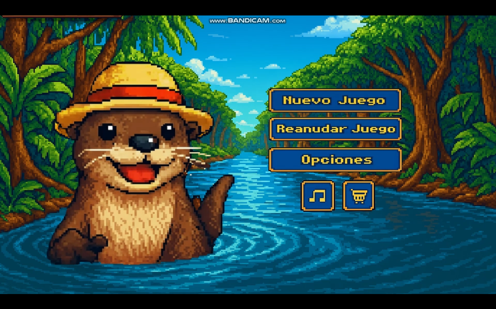
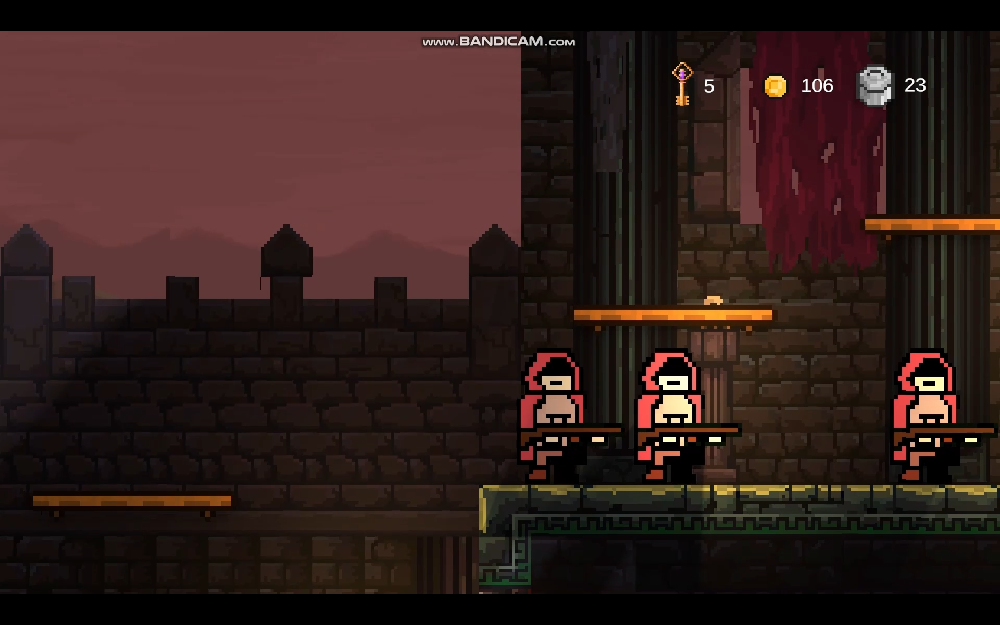
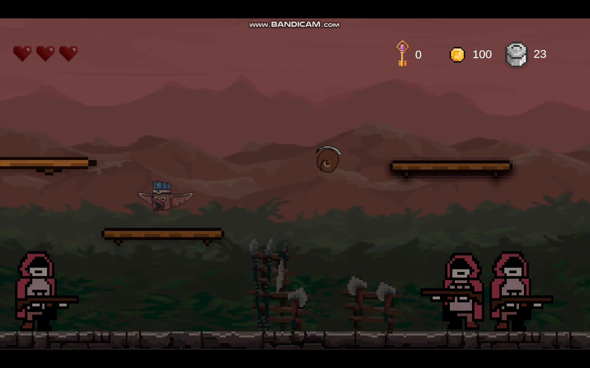
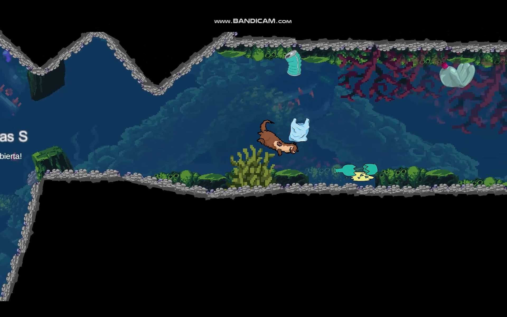

# 🦦 Otter Quest

**Otter Quest** es un juego educativo en 2D desarrollado en Unity. El juego tiene como objetivo enseñar a los niños sobre el cuidado del medio ambiente a través de una jugabilidad divertida e interactiva.

## 🎯 Objetivos del Proyecto

### Objetivo General
Desarrollar un juego sencillo y atractivo que fomente la conciencia ecológica en los niños, mostrando problemas ambientales reales a través de la aventura de una nutria.

### Objetivos Específicos
- Diseñar una interfaz y un estilo visual amigable para los niños.
- Implementar mecánicas que promuevan el respeto por la naturaleza y la fauna.
- Presentar problemas ambientales reales de una forma accesible y gamificada.

## 🌍 Tema y Historia

El jugador asume el rol de una nutria que trata de regresar a su hábitat natural. A lo largo del camino, la nutria debe navegar por áreas afectadas por la actividad humana, como un almacén y aguas contaminadas, antes de llegar a un ecosistema saludable. La narrativa resalta el impacto de la negligencia ambiental y la importancia de la conservación.

## 🧩 Características del Juego

- Movimiento en 2D con elementos de exploración, sigilo y resolución de acertijos.
- Mecánicas simples: nadar, saltar, interactuar con objetos y animales.
- Visuales diseñados para niños, con narración opcional y escenas sencillas.

## 🛠️ Tecnologías

- **Motor:** Unity
- **Lenguaje:** C#
- **Plataforma:** PC

## 📌 Imagenes 
-Interfaz donde permite crear partida con nombre y renudar partida

-Nivel 1 

-Nivel 1

-Nivel 2 

---

*Otter Quest está en desarrollo como parte de un proyecto académico enfocado en el impacto social y educativo a través del diseño de videojuegos.*
